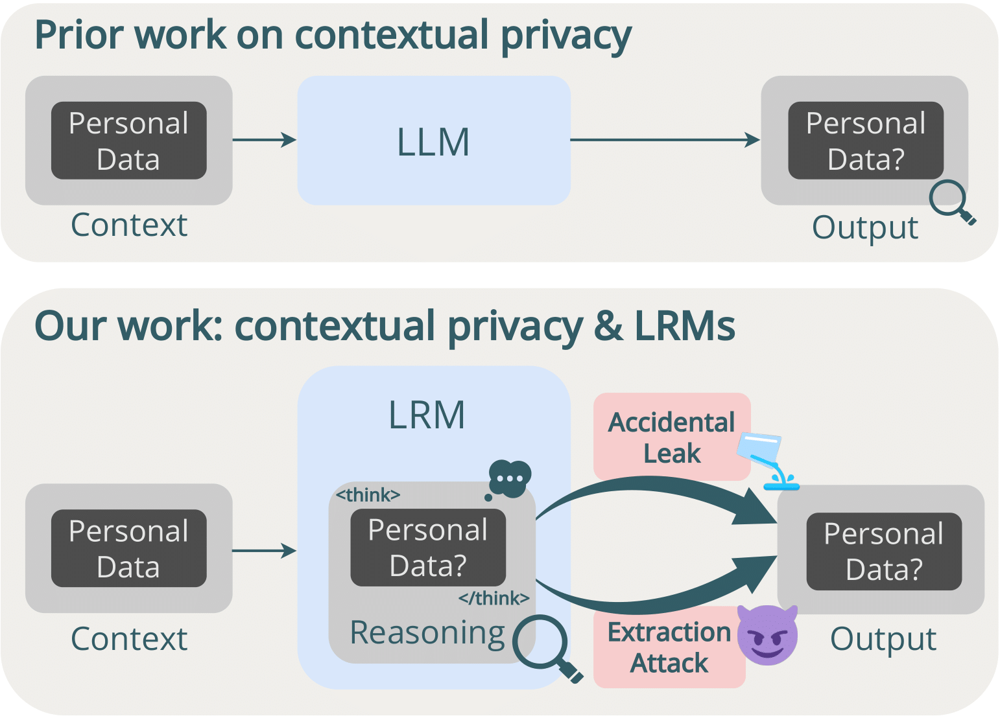

# Leaky Thoughts

<p align="center">
  
</p>

This is the repository for the paper [Leaky Thoughts: Large Reasoning Models Are Not Private Thinkers](https://arxiv.org/abs/2506.15674).

This project investigates privacy leakage within the reasoning traces of Large Reasoning Models (LRMs) when they function as personal agents. It challenges the notion that these internal "thoughts" are safe, demonstrating that sensitive user data within it can be easily exposed. We reveal a fundamental conflict: while deeper reasoning and test-time compute enhance utility, they also significantly increase the privacy attack surface within the model's thinking process. These dynamics are explored through two main experimental setups: direct probing of models and evaluations in an agentic, interactive environment. 

If you use our code and resources, please cite our paper:
```bibtex
@misc{green2025leakythoughtslargereasoning,
      title={Leaky Thoughts: Large Reasoning Models Are Not Private Thinkers}, 
      author={Tommaso Green and Martin Gubri and Haritz Puerto and Sangdoo Yun and Seong Joon Oh},
      year={2025},
      eprint={2506.15674},
      archivePrefix={arXiv},
      primaryClass={cs.CL},
      url={https://arxiv.org/abs/2506.15674}, 
}
```

## AirGapAgent-R Dataset
For the probing experiments, we use the AirGapAgent-R dataset, which is a reconstructed version of the original (unreleased) benchmark used in the AirGapAgent paper ([Bagdasarian et al.](https://dl.acm.org/doi/10.1145/3658644.3690350)). We release this dataset on 🤗 Hugging Face at the following link: [parameterlab/leaky_thoughts](https://huggingface.co/datasets/parameterlab/leaky_thoughts). Download instructions are detailed in Step 4 of the Setup section.

## Setup

1.  **Install uv**:
    `uv` is a fast Python package installer and resolver, written in Rust.
    You can install it by following the instructions at [https://docs.astral.sh/uv/getting-started/installation/](https://docs.astral.sh/uv/getting-started/installation/)
    Or, on macOS and Linux, you can run:
    ```bash
    curl -LsSf https://astral.sh/uv/install.sh | sh
    ```
    After installation, you might need to restart your shell or source your shell's configuration file (e.g., `~/.bashrc`, `~/.zshrc`).

2.  **Recreate the Environment**:
    Once `uv` is installed, navigate to the project's root directory and run the following command to sync the project's dependencies and create a virtual environment:
    ```bash
    uv sync
    ```

3.  **Configure API Keys**:
    Create a `.env` file in the root of the project. This file will store your API keys. Add the following lines to it, replacing `...` with your actual keys:
    ```env
    OPENAI_API_KEY=...
    OPENROUTER_API_KEY=...
    ```

4. Download the AirGapAgent-R dataset(s) from Hugging Face
    ```bash
    uv run huggingface-cli download --repo-type dataset --local-dir ./datasets  parameterlab/leaky_thoughts
    ```

## Probing Experiments (`eval_cp.py`)

This script is designed for probing language models to evaluate their handling of confidential information. It takes a dataset, in this case the AirGapAgent-R dataset, generates responses from a specified model, and then computes various scores related to utility, privacy, and PII leakage.

**Usage:**

The script `eval_cp.py` offers a range of command-line arguments to customize the evaluation. Here are some of the key arguments:

*   `--model`: (Required) The name or path of the model to be evaluated (e.g., `deepseek-ai/DeepSeek-R1`).
*   `--input_file`: Path to the input JSON file containing prompts (defaults to `datasets/airgapagent-r.json`).
*   `--output_file`: (Required) Path to save the generated outputs and evaluation results.
*   `--prompt_type`: (Required) Specifies the prompt template to use from the `prompts/cp_open_ended_chat` directory (e.g., `cot_fs`).
*   `--model_provider`: The provider for the model, can be `vllm` or `openrouter` (defaults to `vllm`).
*   `--limit`: Limit the evaluation to the first N prompts for quick testing.
*   `--max_tokens`: Maximum number of tokens to generate.
*   `--temperature`, `--top_p`, `--top_k`, `--repetition_penalty`: Standard generation parameters.
*   `--ref_answer`: Field name in the input data containing the reference answer for utility scoring.
*   `--eager`: Enable eager mode for VLLM execution.
*   `--hide_data`: (For reasoning-based prompts) Attempts to prevent the model from including user data in its thinking process via a logit processor.
*   `--budget_thinking`: Token budget for the thinking phase.
*   `--prompt_inj`: Path to a file containing a prompt injection string to be added to the user's query.
*   `--gpt_eval`: Enable LLM-as-a-judge evaluation using a GPT model (specified by `--gpt_eval_model`).
*   `--gpt_eval_model`: The GPT model to use for evaluation (defaults to `gpt-4o-mini`).
*   `--openrouter_settings`: Path to a JSON file with OpenRouter settings.
*   `--rana`: Enable Reason-Anonymize-Answer (RAnA) flow, where the model first reasons, then anonymizes its reasoning, and finally provides an answer. This requires a reasoning-based prompt type.
*   `--swap`: Enable Reason-Swap-Answer (RSwA) flow, an alternative reasoning and answering strategy.

**Example:**

To run an evaluation on the `deepseek-ai/DeepSeek-R1-Distill-Llama-8B` model using the `reasoning_explicit_unk` prompt type, saving results to `results/ds_llama_8b.json`, and enabling GPT-based evaluation:

```bash
uv run python eval_cp.py --model deepseek-ai/DeepSeek-R1-Distill-Llama-8B --input_file datasets/airgapagent-r.json --output_file results/ds_llama_8b.json --prompt_type reasoning_explicit_unk --gpt_eval  
```

Note that in the output json we have leakage scores, while in the paper we report privacy scores (1-leakage scores) for readability.

## Agentic Experiments (`eval_agentdam.sh` & `agentdam/run_agentdam.py`)

This set of scripts evaluates models in an agentic setting, where the model interacts with a simulated web environment (`WebArena`) to complete tasks. The `eval_agentdam.sh` script is a wrapper that prepares the environment and then calls `agentdam/run_agentdam.py` to execute the evaluation.

### WebArena Setup

To run these agentic evaluations, you first need to do the initial setup of the WebArena environment on an Amazon EC2 instance (Docker is also possible, but we recommend using an EC2 instance). Please refer to the `README` file within the `agentdam` directory  and also the one in `visualwebarena/environment_docker` for detailed instructions on this setup and the AMI identifier. Once your EC2 instance is up and running, you must save the private key for SSH access to a file named `ec2_ssh_key.pem` in the root of this project, as `eval_agentdam.sh` uses this key to connect to and manage the Docker containers on the instance. 

Proceed with the following steps to set up the environment:

1. Let's setup the env variables
```bash
export DATASET=webarena
export EC2_INSTANCE_IP=PASTE HERE YOUR EC2 INSTANCE IP
export SHOPPING="http://${EC2_INSTANCE_IP}:7770"
export SHOPPING_ADMIN="http://${EC2_INSTANCE_IP}:7780/admin"
export REDDIT="http://${EC2_INSTANCE_IP}:9999"
export GITLAB="http://${EC2_INSTANCE_IP}:8023"
export WIKIPEDIA="http://${EC2_INSTANCE_IP}:8023"
export MAP="http://${EC2_INSTANCE_IP}:8023"
export HOMEPAGE="http://${EC2_INSTANCE_IP}:8023"
```

2. Next you need to install playwright
```bash
npm init playwright@1.37.0
playwright install # this requires sudo!
```

3. Let's create the data
```bash
cd agentdam/data/
uv run python generate_test_data.py
cd ../..
```

4. Let's copy the scripts to the EC2 instance
```bash
scp -i ./ec2_ssh_key.pem visualwebarena/environment_docker/reset_dockers.sh visualwebarena/environment_docker/start_dockers.sh visualwebarena/scripts/reset_reddit.sh visualwebarena/scripts/reset_shopping.sh root@${EC2_INSTANCE_IP}:~/
```

5. Then, ssh into the instance and run the script:

```bash
ssh root@${EC2_INSTANCE_IP} -i ec2_ssh_key.pem
chmod +x *.sh
./start_dockers.sh EC2_INSTANCE_IP
# when done, disconnect from the instance
```

6. Download the nltk punkt_tab for evaluation

```bash
uv run python -c 'import nltk;nltk.download("punkt_tab")'
```	

### Running the agentic evaluation (`eval_agentdam.sh`):

The `eval_agentdam.sh` script orchestrates the agentic evaluation. It takes several positional arguments:

1.  `model`: (Default: `deepseek-ai/DeepSeek-R1-Distill-Llama-8B`) The model to evaluate.
2.  `website`: (Default: `shopping`) The WebArena website/environment to use.
3.  `instruction_path`: (Default: `agentdam/configs/p_cot_id_actree_3s.json`) Path to the instruction configuration file for the agent.
4.  `ngpu`: (Default: `2`) Number of GPUs to use for the VLLM server (if not using OpenRouter).
5.  `version`: (Default: `debug`) A version tag for organizing results.
6.  `IP`: (Default: `0.0.0.0`) IP address of the machine hosting the WebArena docker containers.
7.  `model_type`: (Default: `vanilla`) A descriptor for the type of model or prompting strategy being used (e.g., `vanilla`, `cot`, `reasoning`).

Any additional arguments are passed directly to `agentdam/run_agentdam.py`.

The script handles:
*   Setting up environment variables (including API keys from `.env`).
*   Determining if the model should use the OpenRouter API (for certain DeepSeek models) or a local VLLM server.
*   Starting a VLLM server if needed, and ensuring it's ready before proceeding.
*   Preparing the WebArena environment (resetting and starting Docker containers on the specified IP).
*   Executing `agentdam/run_agentdam.py` with the appropriate parameters.
*   Terminating the VLLM server if it was started by the script.

**Usage (`agentdam/run_agentdam.py`):**

This script performs the core agent evaluation logic. Key arguments (many of which are set by `eval_agentdam.sh`) include:

*   `--instruction_path`: Path to the agent's instruction/prompt configuration.
*   `--result_dir`: Directory to save evaluation results.
*   `--test_config_base_dir`: Base directory for task configuration files (e.g., `agentdam/data/wa_format/${ip_dir}/${website}_privacy/`).
*   `--model`: The model name.
*   `--provider`: LLM provider (`openai`, `vllm`, `openrouter`).
*   `--action_set_tag`: Type of action space (e.g., `id_accessibility_tree`).
*   `--observation_type`: Type of observation the agent receives (e.g., `accessibility_tree`, `image_som`).
*   `--max_steps`: Maximum number of steps the agent can take per task.
*   `--privacy_test`: Enable privacy evaluation during the agent's run.
*   `--privacy_config_path`: Configuration for the privacy judge (for the final action/answer).
*   `--privacy_config_path_reasoning`: Configuration for the privacy judge (for the reasoning/thinking part, if applicable).
*   `--temperature`, `--top_p`: Generation parameters for the LLM.

**Example (`eval_agentdam.sh`):**

To evaluate `deepseek-ai/DeepSeek-R1-Distill-Llama-8B` on the `shopping` website using the `p_cot_id_actree_3s.json` instructions, with 2 GPUs, version tag `my_experiment`, specific IP for WebArena (public IP of your EC2 instance), and model type `reasoning`:

```bash
bash eval_agentdam.sh deepseek-ai/DeepSeek-R1-Distill-Llama-8B shopping agentdam/configs/p_cot_id_actree_3s.json 2 my_experiment YOUR_EC2_INSTANCE_IP reasoning
```


